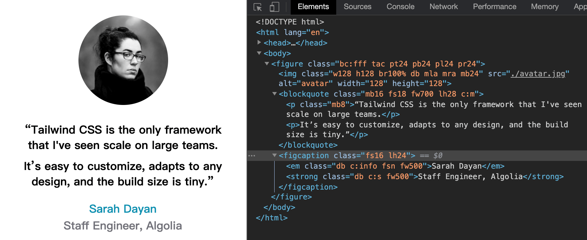
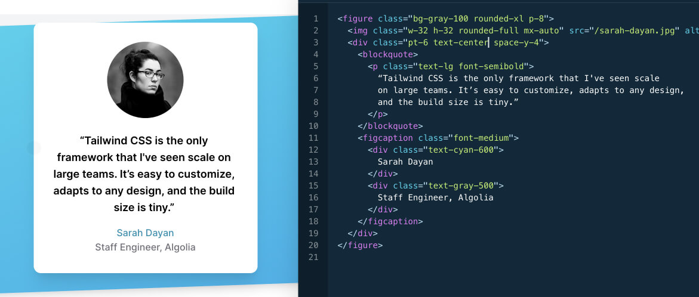

Static Atomic CSS.

Rapidly build modern websites without ever leaving your HTML.

A utility-first CSS framework with strict classes name rule that can be composed to build any design, directly in your markup.

It attempts to solve the same problems as [tailwindcss](https://tailwindcss.com/) but in [Atomic css](https://acss.io/) way.

[![npm package][npm-badge]][npm-url] 
[![jsdelivr][jsdelivr-badge]][jsdelivr-url]
[![github][git-badge]][git-url] 

[npm-badge]: https://img.shields.io/npm/v/sacss.svg
[npm-url]: https://www.npmjs.org/package/sacss
[npm-downloads]: https://img.shields.io/npm/dw/sacss
[git-url]: https://github.com/ziven27/SACSS
[git-badge]: https://img.shields.io/github/stars/ziven27/SACSS.svg?style=social
[jsdelivr-badge]: https://data.jsdelivr.com/v1/package/npm/sacss/badge
[jsdelivr-url]: https://www.jsdelivr.com/package/npm/sacss


静态的 Atomic CSS，是一套具有严格命名规则的 CSS 解决方案，目标是希望让你只需要在 HTML 中就可以快速实现设计原型，而不需要在 HTML 和 CSS 之间来回切换。

这和 [tailwindcss](https://tailwindcss.com/) 要解决的问题是一样的，但不同的是以 [Atomic css](https://acss.io/) 的方式。

## Different

 [tailwindcss](https://tailwindcss.com/) give you a CSS package with classes like `flex`, `pt-4`, `text-center`.
 
 [Atomic css](https://acss.io/) give you a set of naming rules to write class. Base on a builder [Atomizer](https://github.com/acss-io/atomizer), the CSS file is created automatically.
 
 [SACSS](https://ziven27.github.io/sacss) give you a CSS package for quick start. A set of naming rules (easier Atomic CSS ) to extend the package. SASS and LESS mixin provide aliases for most properties that can name in your own way.

 [tailwindcss](https://tailwindcss.com/) 提供了一套有类似 `flex`, `pt-4`, `text-center` 这样命名的 CSS 的类库。
 
 [Atomic css](https://acss.io/) 提供了一套严格 class 的命名规则。基于 [Atomizer](https://github.com/acss-io/atomizer) 这个构建工具，你在 HTML 中每写一个符合这套命名规则的 class，CSS 文件中会自动添加对应的 CSS 样式。

 [SACSS](https://ziven27.github.io/sacss) 提供了一套 class 的命名规则，和一些能覆盖大部分样式的 CSS 类库（同样基于这套命名规则）。同时还提供了一些常用复杂样式的 SASS 和 LESS 的 mixin，你可以使用自己的命名规则去使用这些 mixin。

## install

```bash
$ npm i sacss;
```

## tree

```bash
.
├── mixin.less   // less Mixin
├── mixin.scss   // sass Mixin
└── index.css    // core css package
```

## use



```less
// less
@import 'sacss';
@import 'sacss/mixin.less';

#Margins(8, 16; 1px);                // .mt8, .mr8, .mb8, .ml8, .mt16, .mr16, .mb16, .ml16;
#Paddings(16, 24; 1px);              // .pt16, .pr16, .pb16, .pl16, .pt24, .pr24, .pb24, .pl24;
#SACSS(font-size; fs; 16, 18; 1px);   // .fs16, .fs18;
#SACSS(line-height; lh; 24, 28; 1px); // .lh24, .lh28;
#SACSS(font-weight; fw; 500, 700);    // .fw500, fw700;
```

```HTML
<style>
    .c_m{ color: #000; }
    .c_s{ color: #71717a; }
    .c_info{ color:#0891b2; }
</style>

<figure class="bc_fff tac pt24 pb24 pl24 pr24">
    
    <blockquote class="mb16 fs18 fw700 lh28 c_m">
      <p class="mb8">“Tailwind CSS is the only framework that I've seen scale on large teams.</p>
      <p>It’s easy to customize, adapts to any design, and the build size is tiny.”</p>
    </blockquote>
    <figcaption class="fs16 lh24">
      <em class="db c_info fsn fw500">Sarah Dayan</em>
      <strong class="db c_s fw500">Staff Engineer, Algolia</strong>
    </figcaption>
</figure>
```




This demo is copy from home page of [tailwindcss](https://tailwindcss.com/). It's obvious that SACSS do the same thing with less code.

这个示例图片是仿照 [tailwindcss](https://tailwindcss.com/) 官网做的，可以很明显的看到，实现相同的效果我们用了更少的代码。


## SACSS name rules

| Declarations         | SACSS     | ACSS       | Tailwind CSS      | Blowdrycss           | Basscss          | Tachyons   |
| -------------------- | -------- | ----------- | ----------------- | -------------------- | ---------------- | ---------- |
| `margin: 12px;`      | `.m12`   | `.M(12px)`  | `.m-4`            | `.margin-12`         | `.m2`            | `.ma3`     |
| `text-align: center` | `.tac`   | `.Ta(c)`    | `.text-center`    | `.text-align-center` | `.center`        | `.tc`      |
| `margin: -12px`      | `.m-12`  | `.M(-12px)` | `.-m-4`           | `.margin-n12`        | `.mxn2`          | `.na3`     |
| `font-size: 25px`    | `.fs25`  | `.Fz(25px)` | `.text-2xl`       | `.font-size-25`      | `.h2`            | `.f3`      |
| `width: 50%`         | `.w50%`  | `.W(50%)`   | `.w-1/2`          | `.width-50p`         | `.col-6`         | `.w-50`    |
| `line-height: 1.5`   | `.lh1.5` | `.Lh(1.5)`  | `.leading-normal` | `.line-height-1_5`   | `.line-height-4` | `.lh-copy` |


1. Just take the first letter: `.db{ display:block; }`;
2. Direct link number: `.mb10{ margin-bottom:10px; }`;
3. Symbol use it self with `\` : `.w100\%{ width:100%; } .lh1\.2{ line-height:1.2 }`;
4. custom values split with `_` : `.c_fff{ color:#fff; }`
5. hover split with  `\:h`, `.fs12{ font-size:12px; } .fs12\:h:hover{ font-size:12px; }`

------ 

1. 只取首字母: `.db{ display:block; }`;
2. 有数字直接连接: `.mb10{ margin-bottom:10px; }`;
3. 符号直接用 `\` 转义:  `.w100\%{ width:100%; } .lh1\.2{ line-height:1.2 }`;
4. 其它，或自定义样式，用 `_`分割 `.c_fff{ color:#fff; }`
5. hover 样式，用 `\:h`分割 `.fs12{ font-size:12px; } .fs12\:h:hover{ font-size:12px; }`

## Mixin

SASS and LESS got the same name mixin.

SASS 和 LESS 拥有完全相同的 mixin.

### Mixin Clearfix

clear float
清除 float 的浮动

```less
/* 清除浮动 */
#Clearfix(){
  &:after{
    display: table; content: ''; clear: both;
  }
}
```

### Mixin Ellipsis

Single line text overflow with ellipsis.
单行文本超出显示`...`；

```less
#Ellipsis(){ white-space: nowrap; overflow: hidden; text-overflow: ellipsis; }
```

### Mixin Ellipsis-multiple

Multiple line text overflow with ellipsis.

多行文本超出显示 `...`

```less
#Ellipsis-multiple(){ display: -webkit-box; overflow: hidden; word-wrap: break-word; -webkit-box-orient: vertical; }
```

### Mixin Cell

Fill the left space

撑满剩余空间

```less
#Cell(){ display: table-cell; *display: inline-block; width: 2000px; *width: auto; }
```

### Mixin SACSS | Margins | Paddings

help you to create SACSS.

快速创建 SACSS 的代码。

```less
#SACSS(font-size; fs; 12, 16; 1px);        // .fs12, .fs16;
#SACSS(line-height; lh; 16, 20, 24; 1px);  // .lh16, .lh20;
#Margins(8, 16, 24; 1px);                  // .mt8, .mr8, .mb8, .ml8, .mt16, .mr16, .mb16, .ml16;
#Paddings(8, 16, 24; 1px);                 // .pt8, .pr8, .pb8, .pl8, .pt16, .pr16, .pb16, .pl16;
```

Custom unit

自定义单位

```less
#SACSS(font-size; fs; 12, 16; 1/16 * 1rem); // .fs12{ fontsize: 12 * 1 /16 *1rem; } .fs16{ fontsize: 16 * 1 /16 *1rem; }
```

## Recommended class name

Only `bc_fff`, `bc_000`, `c_000`,`c_fff` inside of `sacss/index.css`。

只有 `bc_fff`, `bc_000`, `c_000`,`c_fff` 这四个颜色相关样式内置在 `sacss/index.css` 文件中。

### except

```
.bc_fff {
  background-color: #fff;
}
.bc_000 {
  background-color: #000;
}
.c_000 {
  color: #000;
}
.c_fff {
  color: #fff;
}
```

The other style below is not contain in `sacss/index.css`, just recommended to use like this.

其它的样式只是推荐约定，并未内置在`sacss/index.css` 文件中。

### color

```css
/*!
 *  rules  '.c_{custome name}{ color: value; }}'
 */
.c_xl { color: #111; }
.c_l { color: #333; }
.c_m { color: #666; }
.c_s { color: #999; }
.c_xs { color: #ddd; }
.c_primary { color: blue; }
.c_secondary { color: gray; }
.c_danger { color: red; }
.c_warning { color: yellow; }
.c_success { color: green; }
.c_info { color: cadetblue; }
.c_light { color: #f8f9fa; }
.c_dark { color: #343a40; }
```

### Global style

```Less
@import 'sacss/mixin.less';
/*!
 *  with `g_` start
 *  Composition with `_` start
 */

/* global header */
.g_header{  }

/* global footer */
.g_footer{  }

/* grid layout row class name */
@rowWidth: 1008px;
@gutterWith: 14px;
.g_row{ width: @rowWidth; margin-left: auto; margin-right: auto; #Clearfix;  } 

/* grid layout column class name */
.g_col{ width: @rowWidth / 12 - 2 * @gutterWith; float: left; margin-left: @gutterWith; margin-right: @gutterWith; }
.g_col._2 { width: @rowWidth / 12 * 2 - 2 * @gutterWith; }
.g_col._3 { width: @rowWidth / 12 * 3 - 2 * @gutterWith; }
.g_col._4 { width: @rowWidth / 12 * 4 - 2 * @gutterWith; }
.g_col._5 { width: @rowWidth / 12 * 5 - 2 * @gutterWith; }
.g_col._6 { width: @rowWidth / 12 * 6 - 2 * @gutterWith; }
.g_col._7 { width: @rowWidth / 12 * 7 - 2 * @gutterWith; }
.g_col._8 { width: @rowWidth / 12 * 8 - 2 * @gutterWith; }
.g_col._9 { width: @rowWidth / 12 * 9 - 2 * @gutterWith; }
.g_col._10 { width: @rowWidth / 12 * 10 - 2 * @gutterWith; }
.g_col._11 { width: @rowWidth / 12 * 10 - 2 * @gutterWith; }

/* main container of content, center of the page with the width of 980px */
@wrapWidth: @rowWidth - 2 * @gutterWith;
.g_wrap{ width: @wrapWidth; margin-left: auto; margin-right: auto;   } 
```


