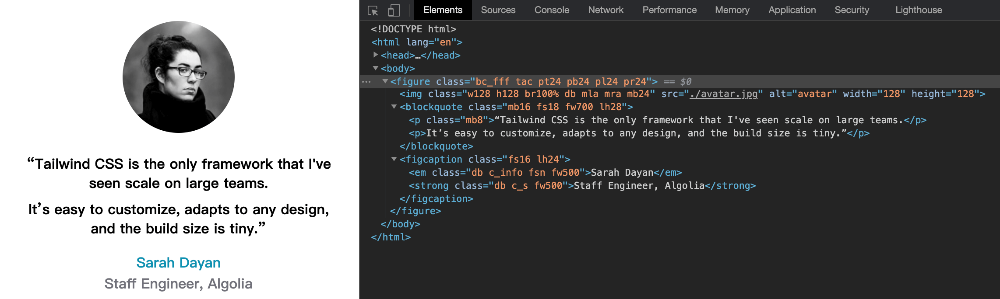
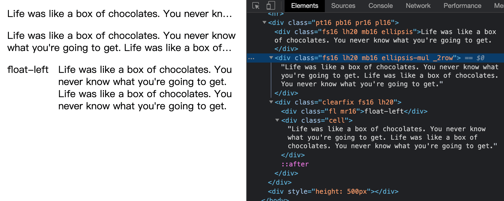

# Static Atomic CSS.

[简体中文](./lang/zh.md) ｜ 英文

Rapidly build modern websites without ever leaving your HTML.

A utility-first CSS framework with strict classes name rule that can be composed to build any design, directly in your markup.

It attempts to solve the same problems as [tailwindcss](https://tailwindcss.com/) but in [Atomic css](https://acss.io/) way.

[![npm package][npm-badge]][npm-url] 
[![jsdelivr][jsdelivr-badge]][jsdelivr-url]
[![github][git-badge]][git-url] 

[npm-badge]: https://img.shields.io/npm/v/sacss.svg
[npm-url]: https://www.npmjs.org/package/sacss
[npm-downloads]: https://img.shields.io/npm/dw/sacss
[git-url]: https://github.com/ziven27/SACSS
[git-badge]: https://img.shields.io/github/stars/ziven27/SACSS.svg?style=social
[jsdelivr-badge]: https://data.jsdelivr.com/v1/package/npm/sacss/badge
[jsdelivr-url]: https://www.jsdelivr.com/package/npm/sacss


## Different

 [tailwindcss](https://tailwindcss.com/) give you a CSS package with classes like `flex`, `pt-4`, `text-center`.
 
 [Atomic css](https://acss.io/) give you a set of naming rules to write class. Base on a builder [Atomizer](https://github.com/acss-io/atomizer), the CSS file is created automatically.
 
 [SACSS](https://ziven27.github.io/sacss) give you a CSS package for quick start. A set of naming rules (easier Atomic CSS ) to extend the package. SASS and LESS mixin provide aliases for most properties that can name in your own way.

## best practice

SACSS does not cover all scenarios, The best practice is to dovetail design materials and CSS style layout. 


[Figma token to code](https://www.figma.com/community/plugin/759651077059504375/Token--%3E-Code) This plugin can automatically help you to get the SACSS code from the Figma design.


## install

```bash
$ npm i sacss;
```

## tree

```bash
.
├── mixin.less   // less Mixin
├── mixin.scss   // sass Mixin
└── index.css    // core css package
```

## use



```less
// less
@import 'sacss';
@import 'sacss/mixin.less';

#Margins(8, 16; 1px);                // .mt8, .mr8, .mb8, .ml8, .mt16, .mr16, .mb16, .ml16;
#Paddings(16, 24; 1px);              // .pt16, .pr16, .pb16, .pl16, .pt24, .pr24, .pb24, .pl24;
#SACSS(font-size; fs; 16, 18; 1px);   // .fs16, .fs18;
#SACSS(line-height; lh; 24, 28; 1px); // .lh24, .lh28;
#SACSS(font-weight; fw; 500, 700);    // .fw500, fw700;
```

```HTML
<style>
    .c_m{ color: #000; }
    .c_s{ color: #71717a; }
    .c_info{ color:#0891b2; }
</style>

<figure class="bc_fff tac pt24 pb24 pl24 pr24">
    
    <blockquote class="mb16 fs18 fw700 lh28 c_m">
      <p class="mb8">“Tailwind CSS is the only framework that I've seen scale on large teams.</p>
      <p>It’s easy to customize, adapts to any design, and the build size is tiny.”</p>
    </blockquote>
    <figcaption class="fs16 lh24">
      <em class="db c_info fsn fw500">Sarah Dayan</em>
      <strong class="db c_s fw500">Staff Engineer, Algolia</strong>
    </figcaption>
</figure>
```


This demo is copy from home page of [tailwindcss](https://tailwindcss.com/).


## SACSS name rules

| Declarations         | SACSS     | ACSS       | Tailwind CSS      | Blowdrycss           | Basscss          | Tachyons   |
| -------------------- | -------- | ----------- | ----------------- | -------------------- | ---------------- | ---------- |
| `margin: 12px;`      | `.m12`   | `.M(12px)`  | `.m-4`            | `.margin-12`         | `.m2`            | `.ma3`     |
| `text-align: center` | `.tac`   | `.Ta(c)`    | `.text-center`    | `.text-align-center` | `.center`        | `.tc`      |
| `margin: -12px`      | `.m-12`  | `.M(-12px)` | `.-m-4`           | `.margin-n12`        | `.mxn2`          | `.na3`     |
| `font-size: 25px`    | `.fs25`  | `.Fz(25px)` | `.text-2xl`       | `.font-size-25`      | `.h2`            | `.f3`      |
| `width: 50%`         | `.w50%`  | `.W(50%)`   | `.w-1/2`          | `.width-50p`         | `.col-6`         | `.w-50`    |
| `line-height: 1.5`   | `.lh1.5` | `.Lh(1.5)`  | `.leading-normal` | `.line-height-1_5`   | `.line-height-4` | `.lh-copy` |


1. Just take the first letter: `.db{ display:block; }`;
2. Direct link number: `.mb10{ margin-bottom:10px; }`;
3. Symbol use it self with `\` : `.w100\%{ width:100%; } .lh1\.2{ line-height:1.2 }`;
4. custom values split with `_` : `.c_fff{ color:#fff; }`
5. hover split with  `\:h`, `.fs12{ font-size:12px; } .fs12\:h:hover{ font-size:12px; }`


## Mixin

SASS and LESS got the same name mixin.

1. `Clearfix`: clear float;
2. `Ellipsis`: Single line text overflow with ellipsis.
3. `Ellipsis-multiple`: Multiple line text overflow with ellipsis.
4. `Cell`: Fill the left space
5. `Margins`: Create `margin-top` `margin-right` `margin-bottom` `margin-left` at same time;
6: `Paddings`: Create `padding-top` `padding-right` `padding-bottom` `padding-left` at same time;
7: `SACSS`: create SACSS in short hand;
8: `_SACSS`: mixin of all css style in `index.css`, you can use this to add prefix for each rules;




``` less
@import 'sacss/mixin.less';

// custom units
// #SACSS(font-size; fs; 12, 16; 1/16 * 1rem); // .fs12{ fontsize: 12 * 1 /16 *1rem; } .fs16{ fontsize: 16 * 1 /16 *1rem; }
#SACSS(font-size; fs; 12, 16; 1px);        // .fs12, .fs16;

#SACSS(line-height; lh; 16, 20, 24; 1px);  // .lh16, .lh20;

#Margins(8, 16, 24; 1px);                  // .mt8, .mr8, .mb8, .ml8, .mt16, .mr16, .mb16, .ml16;
#Paddings(8, 16, 24; 1px);                 // .pt8, .pr8, .pb8, .pl8, .pt16, .pr16, .pb16, .pl16;

.clearfix{ #Clearfix;  }
.ellipsis{ #Ellipsis;  }
.cell{ #Cell; }
.ellipsis-mul{ #Ellipsis-multiple;  }
.ellipsis-mul._2row{ -webkit-line-clamp: 2; }
```

``` html
<div class="fs12 lh16 ellipsis">
    Life was like a box of chocolates. You never know what you're going to get.
</div>
<div class="fs12 lh16 ellipsis-mul _2row">
    Life was like a box of chocolates. You never know what you're going to get.
</div>
<div class="clearfix">
    <div class="fl mr16">float-left</div>
    <div class="cell">Life was like a box of chocolates. You never know what you're going to get.</div>
<div>
```

### Prefix

with this mixin `_SACSS`，you can and prefix to each rules.

> For a better development experience, use pure `index.css`(without any prefix) is recommended.

```less
@import 'sacss/mixin.less';

@prefix:'acss_';
#_SACSS(@prefix); // all the rules will with `acss_`（except other mixin）

#SACSS(font-size; escape('@{prefix}fs'); 12, 16; 1px); // .acss_fs12, .acss_fs16;

// ...other mixin
```

```sass
@import 'sacss/mixin.scss';

$prefix:'acss_';
@inclued _SACSS($prefix); // all the rules will with `acss_`

// .acss_fs12, .acss_fs16
@inclued SACSS(font-size; #{$prefix}fs; 12, 16; 1px); // Add prefix manually

// ...other mixin
```


## Recommended class name

Only `bc_fff`, `bc_000`, `c_000`,`c_fff` inside of `sacss/index.css`。
The other style below is not contain in `sacss/index.css` just recommended conventions.

```
.bc_fff { background-color: #fff; }
.bc_000 { background-color: #000; }
.c_000 { color: #000; }
.c_fff { color: #fff; }
```

### color

```css
/*!
 *  rules  '.c_{custome name}{ color: value; }}'
 */
.c_xl { color: #111; }
.c_l { color: #333; }
.c_m { color: #666; }
.c_s { color: #999; }
.c_xs { color: #ddd; }
.c_primary { color: blue; }
.c_secondary { color: gray; }
.c_danger { color: red; }
.c_warning { color: yellow; }
.c_success { color: green; }
.c_info { color: cadetblue; }
.c_light { color: #f8f9fa; }
.c_dark { color: #343a40; }
```
